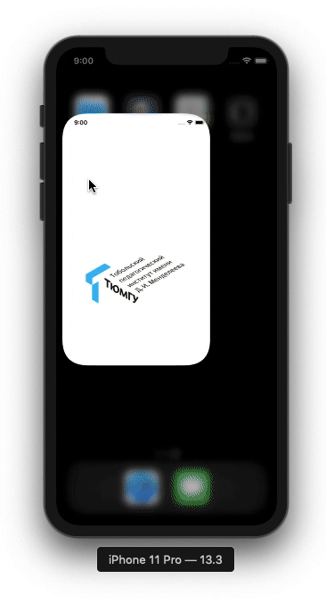

# Расписание ТюмГУ
Приложения для просмотра расписания Тобольского педагогического института им. Д.И. Менделеева.



## О приложении
Представляет [расписание вуза](https://docs.google.com/spreadsheets/d/1CrVXpFRuvS4iq8nvGpd27-CeUcnzsRmbNc9nh2CWcWw/edit#gid=1936799010) в удобоваримой форме.

## Использовалось:
* Xcode 11.3.*
* Swift 5.*

## Установка:
1. Скачать
2. Добавить ```ApiKey```
3. Пользоваться
